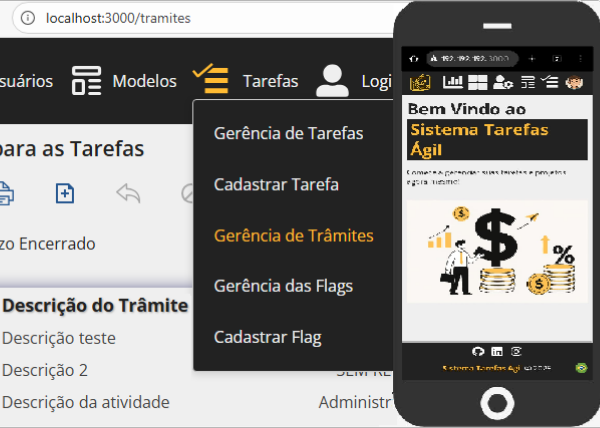

# SistemaTarefas Frontend em React


[](LICENSE)

Este documento descreve as **práticas e decisões de implementação** do frontend do `SistemaTarefas`, desenvolvido em **React puro** com **CSS responsivo sem frameworks externos**.



O objetivo é demonstrar um frontend moderno, bem estruturado e de fácil manutenção, com foco em:

**Consumo limpo e seguro da API** (com tratamento centralizado de respostas e erros);

**Experiência do usuário responsiva e fluida**;

**Boas práticas de arquitetura e reutilização de código**.

---

## Frontend com Projetos relacionados

**Este projeto frontend em React.js faz parte de um ecossistema composto por três aplicações interligadas:**

| 🧩 Projetos | 💬 Descrição | 📁 Repositório|
|----------|------------|-------------|
| **API** | API RESTful desenvolvida em **C# (.NET)**, responsável por fornecer os dados e a lógica de negócio. | [SistemaTarefas API](https://github.com/anderson-asouza/sistema-tarefas-api) |
| **Frontend** | Aplicação em **React.js** que consome a API e fornece a interface web para o usuário. | *(Este projeto)* |
| **Robot** | Automação em **Selenium** que interage com o frontend web para automatização de testes e processos. | [SistemaTarefas Robot](https://github.com/anderson-asouza/sistema-tarefas-robot) |

> 💡 Observação: Para executar o frontend, é necessário ter a API em funcionamento localmente ou hospedada.
>
> O Robot depende do frontend estar acessível para realizar as automações.

---

## Índice

- [1. Introdução](#1-introdução)
- [2. Estrutura e Responsividade](#2-estrutura-e-responsividade)
- [3. Gerenciamento de Sessão e Token](#3-gerenciamento-de-sessão-e-token)
- [4. Comunicação com a API](#4-comunicação-com-a-api)
  - [4.1 Validação Centralizada de Resposta (`ValidaRetornoAPI`)](#41-validação-centralizada-de-resposta-validaretornoapi)
  - [4.2 Tradução e Adaptação de Mensagens (`TraduzMensagemErroBackend`)](#42-radução-e-adaptação-de-mensagens-traduzmensagemerrobackend)
- [5. Cache Condicional e Massa de Dados](#5-cache-condicional-e-massa-de-dados)
- [6. Paginação e Loading](#6-paginação-e-loading)
- [7. Internacionalização (i18n)](#7-internacionalização-i18n)
- [8. Diálogos e Mensagens Personalizadas](#8-diálogos-e-mensagens-personalizadas)
- [9. Configurações e Constantes](#9-configurações-e-constantes)
- [10. Execução Local](#10-execução-local)
- [11. Benefícios e Diferenciais](#11-benefícios-e-diferenciais)

---

## 1. Introdução

O **frontend SistemaTarefas** foi desenvolvido em **React** (Hooks + componentes funcionais) e tem como foco principal **clareza estrutural, modularidade e experiência responsiva fluida**, consumindo diretamente a `API SistemaTarefas`.

**Pontos fortes:**

- Estrutura **leve e sem dependências desnecessárias** (sem frameworks CSS).

- Responsividade nativa com CSS puro e regras customizadas.

- Geração arquivos em PDF para impressão.

- Sistema de **sessão e autenticação persistente** via `sessionStorage`.

- Tratamento **inteligente e centralizado de erros da API**.

- **Cache condicional** para melhorar performance em grandes listas.

- Suporte **multilíngue completo** (auto-detecção + troca manual de idioma).

- Componentes bem construídos para **alertas, diálogos e splash screens**.

---

## 2. Estrutura e Responsividade

Todo o layout foi construído em **CSS puro**, utilizando media queries e técnicas flexíveis.
A interface se adapta integralmente a dispositivos móveis, exceto em listas horizontais longas (intencionalmente com rolagem lateral).

> Nenhum framework CSS (Bootstrap, Material UI etc.) foi utilizado.
> O objetivo foi demonstrar domínio de CSS responsivo do zero.

---

## 3. Gerenciamento de Sessão e Token

O login é persistido na sessão com a função `SalvaDadosLogin()`, armazenando informações seguras no `sessionStorage`:

```ts
export function SalvaDadosLogin(id, login, nome, nivel, matricula, foto, token) {
  sessionStorage.setItem("id", id);
  sessionStorage.setItem("login", login);
  ...
}
```

A recuperação é feita por `GetDadosLogin(dado)`, que retorna qualquer campo salvo ou null se inválido.

Há também **validação periódica do token**, centralizada num único ponto do sistema, que dispara alerta e limpa a sessão ao detectar expiração:

```ts
useEffect(() => {
  const intervalo = setInterval(() => {
    if (token && tokenExpirado()) {
      Alerta({ mensagem: t("api.tokenExpirado") });
      sessionStorage.setItem("token", '');
      window.dispatchEvent(new Event('atualizarLogin'));
    }
  }, 60000);
  return () => clearInterval(intervalo);
}, [token]);
```

---

## 4. Comunicação com a API

A comunicação com a API utiliza fetch e é centralizada para facilitar manutenção e tratamento uniforme.

### 4.1 Validação Centralizada de Resposta (`ValidaRetornoAPI`)

Toda resposta da API é validada antes de chegar ao componente.
A função `ValidaRetornoAPI()` interpreta status HTTP, mensagens e estrutura JSON, e lida com expiração de token, permissões e erros genéricos.

> Isso permite que qualquer componente React receba sempre uma resposta padronizada:
```ts
 { erro, dados, count }
 ```

### 4.2 Tradução e Adaptação de Mensagens (`TraduzMensagemErroBackend`)

A função `TraduzMensagemErroBackend()` converte os `errorCode` vindos da API em mensagens legíveis no idioma atual:

```ts
if (m.includes("REGISTRO_NAO_ENCONTRADO"))
   return t("api.msgRegistroNaoEncontrado");
```

Além disso, interpreta erros compostos e concatena mensagens — útil para exibir múltiplas validações ao usuário de forma amigável.

---

## 5. Cache Condicional e Massa de Dados

O sistema utiliza uma abordagem inteligente de cache em memória:
Caso a quantidade de registros da entidade seja **menor ou igual** a por exemplo `DEF_MASSA_USUARIOS` que é a massa referente a entidade Usuários, as próximas consultas são feitas localmente (sem nova requisição à API). Abordagem em todas as entidades do sistema.

Essa técnica melhora o desempenho e demonstra **controle consciente de consumo de API**.

```ts
if (countMassaDados.current > DEF_MASSA_USUARIOS)
  url.searchParams.append("nomeUsuario", filtroEffectNomeUsuario);
```

---

## 6. Paginação e Loading

As listas exibem **paginação manual** com componentes controlados e indicador de carregamento (`<Loading />`).

```ts
{ativaLoading ? <Loading /> : <TabelaUsuarios />}
```

O usuário pode navegar entre páginas, digitar o número manualmente e visualizar o total de itens com formatação localizada.

---

## 7. Internacionalização (i18n)

O projeto oferece suporte multilíngue (atualmente Português, Inglês e Espanhol).
O idioma é detectado automaticamente com base no navegador/dispositivo, podendo ser alterado manualmente pelo ícone de idioma no rodapé.

Todas as mensagens, inclusive alertas e diálogos, utilizam a função `t()` para tradução dinâmica.

---

## 8. Diálogos e Mensagens Personalizadas

Há três componentes principais de interação com o usuário:

- `Alerta()` – exibe mensagens de aviso, erro ou sucesso.

- `Pergunta()` – diálogo de confirmação com suporte multilíngue.

- `Splash()` – mensagem flutuante temporária com timeout configurável.

O evento global `chamarSplash` garante que o splash funcione corretamente mesmo em mudanças de rota:

Garantido por Evento:

```ts
window.addEventListener("chamarSplash", chamarSplash);
```

Simplesmente chamando o método assim:

```ts
ChamarSplash(id === 0 ? t('cadastroSalvo') : t('cadastroAtualizado'));
```

---

## 9. Configurações e Constantes

Todas as constantes estão centralizadas em um único arquivo:

```ts
export const URL_API = 'https://192.168.0.50:5001/api/';
export const URL_PROFILE = 'https://192.168.0.50:5001/profile/';
export const TITULO = 'Sistema Tarefa Ágil';
export const MOEDA = 'R$';
export const TAM_CAMPO = 50;
```

Além disso, há **FLAGS de teste** para simular delays e exibição de erros, facilitando depuração:

```ts
export const FLAGS = {
  TESTE_LOADING: false,
  ERROS_CONSOLE: false,
  ERROS_ALERTA: false
};
```

---

## 10. Execução Local

Para rodar o projeto localmente:

🔧 **Pré-requisitos**

- Node.js 18+

- NPM (instalado junto com Node)

🧩 **Instalação das dependências**

```ts
npm install --legacy-peer-deps react-icons react-router-dom uuid clsx i18next react-i18next i18next-http-backend i18next-browser-languagedetector pdfmake date-fns
```

> O uso do parâmetro --legacy-peer-deps é necessário para evitar conflitos entre versões de dependências do React.

▶️ **Execução**

```ts
npm start
```
> O projeto segue o padrão React: iniciará automaticamente em ambiente local (porta padrão `3000`).

---

## 11. Benefícios e Diferenciais

- **Frontend 100% React + CSS puro** (sem dependências externas).

- **Arquitetura limpa e modular**, com funções centralizadas de API e sessão.

- **Cache condicional** – técnica que demonstra otimização real.

- **Tratamento multilíngue** completo, inclusive para mensagens de erro da API.

- **Paginação, loading e feedbacks visuais personalizados**.

- **Alerta, Pergunta e Splash** integrados ao sistema de tradução.

- **Responsividade manual e controlada**, adaptada a telas pequenas.

- **Foco em clareza e boas práticas**, ideal como projeto de portfólio profissional.

---